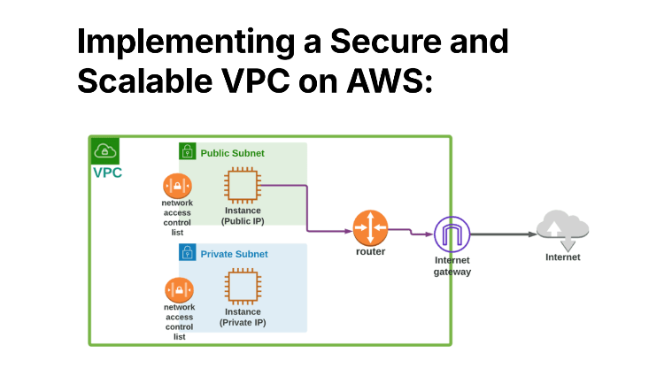

# Implementing a Secure and Scalable VPC Network Architecture on AWS 🔐

## 📌 Project Overview
This repository documents the custom creation and network governance setup for an isolated cloud network environment using Amazon Virtual Private Cloud (VPC). The project focuses on custom subnet allocation, traffic routing mechanics, internet gateway configuration, and safeguarding internet-facing compute nodes using security group firewalls.

---

## 🗺️ Network Architecture Diagram
Below is the structural topography engineered for this deployment:

  

---

## 📚 Detailed Step-by-Step Documentation
For an exhaustive, hands-on walkthrough containing configuration steps, CLI mechanics, and deployment workflows, you can view or download the complete project report directly:

📁 **[Download the Step-by-Step Project PDF Report](./Implementing-a-Secure-and-Scalable-VPC-on-AWS.pdf?raw=true)**

---

## 🏗️ Network Architecture Design
The network infrastructure is built from the ground up to ensure structural isolation and efficient packet routing:
* **Custom VPC:** Provisioned a secure cloud network named `kaif-vpc-version1project`.
* **IP Address Space:** Allocated a primary Classless Inter-Domain Routing (**CIDR**) block of `10.0.0.0/16`.
* **Subnet Segmentation:** Partitioned a custom public subnet segment named `Public 1` using a `/24` prefix strategy.
* **Dynamic IP Allocation:** Enabled `Auto-assign public IPv4 address` rules to ensure compute nodes automatically receive public entry points upon deployment.

## 🔀 Internet Routing & Gateway Integration
To transition an isolated private network segment into a functional, internet-accessible environment, a bidirectional communication path was engineered:
1. **Internet Gateway Deployment:** Provisioned `Kaif-internet-gateway` and attached it directly to the root VPC boundary.
2. **Custom Route Tables:** Configured an explicit routing rule (`0.0.0.0/0`) directing outbound packets out through the Internet Gateway. This allows the resources in the public subnet to securely exchange data with external services.

## 🛡️ Firewall Security Configurations
A key challenge resolved during this deployment was fine-tuning security access control matrix rules to balance accessibility with perimeter safety:
* **Inbound Access Control:** Structured strict firewall entry lists within **Security Groups** to map out and isolate authorized user paths.
* **Micro-segmentation:** Leveraged Network Access Control Lists (**NACLs**) at the subnet boundary and Security Groups at the instance level to prevent potential vulnerabilities and eliminate unauthorized traffic flow vectors.

## 📊 Key Takeaways & Competencies
* Handled practical classless IP routing calculations and subnet mask budgeting.
* Mastered bidirectional cloud architecture routes, internet gateway attachment pipelines, and subnet destination tables.
* Gained experience aligning loose public network vectors with strict principle-of-least-privilege perimeter constraints.
